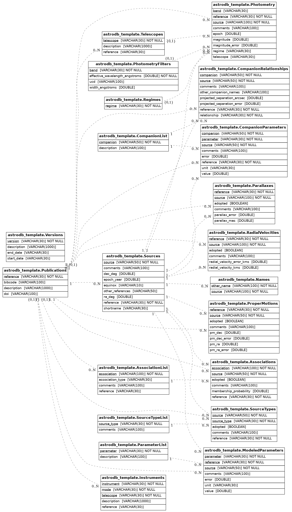

astrodb-template-db
---------------------------

A template schema for astronomical databases. 

Usage instructions are included in the companion astrodb-utils package: [Getting started with a new database](https://astrodb-utils.readthedocs.io/en/latest/pages/make_new_db/getting_started_new_database.html)

Entity relationship diagram of the template schema

