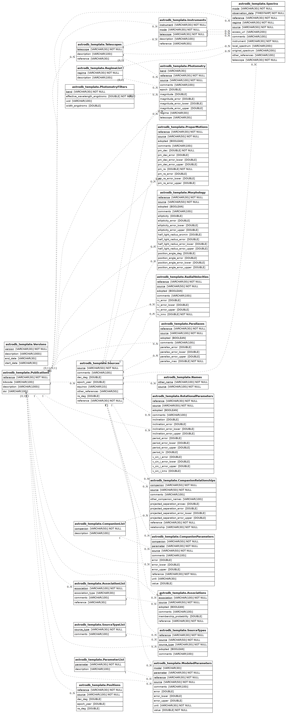

astrodb-template-db
---------------------------

  

A template schema for astronomical databases. 

Usage instructions are included in the companion `astrodb-utils` package: [Getting started with a new database](https://astrodb-utils.readthedocs.io/en/latest/pages/make_new_db/getting_started_new_database.html)

Entity relationship diagram of the template schema

Acknowledgments
---------------

- The telescope and instrument data are based on the Weizmann Interactive Supernova Data Repository (WISeREP), <https://www.wiserep.org>.
Yaron, O. & Gal-Yam, A. 2012, PASP, 124, 668 ([2012PASP..124..668Y](https://ui.adsabs.harvard.edu/abs/2012PASP..124..668Y)).

---
<!-- Do not delete this line. It is used to identify repositories based on this template. -->
This repository is based on the [astrodb-template](https://github.com/astrodbtoolkit/astrodb-template-db) template repository, which is part of the [AstroDB Toolkit](https://github.com/astrodbtoolkit).
