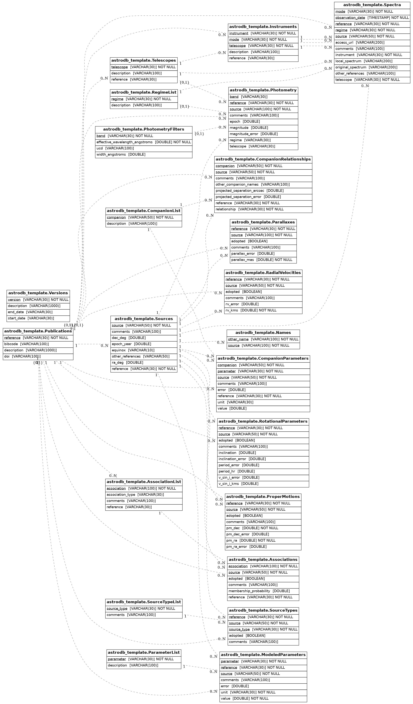

# Schema Documentation
This documentation is generated from the [schema.yaml](schema/schema.yaml) file using [build_schema_docs.py](scripts/build_schema_docs.py).

## Tables
- [Publications](schema/Publications.md)
- [Telescopes](schema/Telescopes.md)
- [Instruments](schema/Instruments.md)
- [PhotometryFilters](schema/PhotometryFilters.md)
- [Versions](schema/Versions.md)
- [RegimeList](schema/RegimeList.md)
- [AssociationList](schema/AssociationList.md)
- [ParameterList](schema/ParameterList.md)
- [CompanionList](schema/CompanionList.md)
- [SourceTypeList](schema/SourceTypeList.md)
- [Sources](schema/Sources.md)
- [Names](schema/Names.md)
- [Positions](schema/Positions.md)
- [Photometry](schema/Photometry.md)
- [Parallaxes](schema/Parallaxes.md)
- [RadialVelocities](schema/RadialVelocities.md)
- [CompanionRelationships](schema/CompanionRelationships.md)
- [CompanionParameters](schema/CompanionParameters.md)
- [Associations](schema/Associations.md)
- [SourceTypes](schema/SourceTypes.md)
- [ProperMotions](schema/ProperMotions.md)
- [ModeledParameters](schema/ModeledParameters.md)
- [RotationalParameters](schema/RotationalParameters.md)
- [Spectra](schema/Spectra.md)

## Schema Diagram
This diagram is generated from the [schema.yaml](schema/schema.yaml) file using [make_schema_erd.py](scripts/make_schema_erd.py).

